&nbsp;

## *Chara*
# Проект: Классификация психотипа личности по изображению лица с использованием микросервисов

## Описание
Этот проект предоставляет веб-приложение на Django для загрузки изображений и получения прогнозов по их классам. Прогнозирование выполняется отдельным инференс-сервером с моделью машинного обучения. Микросервисы развертываются с помощью `docker-compose`.

## Архитектура
Проект состоит из двух микросервисов:
1. **Django-сервис**:
   - Позволяет пользователям загружать изображения через веб-интерфейс.
   - Отправляет запросы на инференс-сервер для получения прогнозов.
2. **Инференс-сервер**:
   - Развертывается с использованием Flask или кастомного REST API для выполнения прогнозов модели.

## Функционал
- Загрузка изображений через веб-интерфейс.
- Обработка изображений и отправка на сервер для инференса.
- Отображение результата пользователю.

## Требования
- Скачать и установить Docker https://www.docker.com/products/docker-desktop/
- Установить Windows Subsystem for Linux (понадобится для обучения моделей нейронных сетей на GPU локально) 

## Установка и запуск
1. Клонируйте репозиторий:
   ```bash
   git clone https://github.com/GeekNekoS/Chara.git

2. Выберите версию Python для WSL: 3.11.0rc1 WSL 
3. Установите зависимости:  `pip install -r requirements_django.txt`
4. Подготовьте датасет, приведя названия к одному формату <image_n.jpg>
и конвертнув разные форматы изображений, запустив файл make_data.py, 
предварительно заполнив в строке файла путь до оригинального датасета datadir и путь, 
куда сохранится обработанный датасет target_dir

5. Все артефакты обучения сохраняются с помощью фреймворка mlflow, 
надо поднять сервер mlflow локально на вашем компьютере.
Чтобы запустить сервер MLflow, необходимо выполнить несколько шагов:

   1. **Установите MLflow**, если это еще не сделано:
      ```bash
      pip install mlflow
      ```

   2. **Запустите сервер MLflow**. Для этого используйте команду:
      ```bash
      mlflow server
      ```
      или
      ```bash
      mlflow ui
      ```
   По умолчанию сервер запускается на порту `5000`, 
и он доступен по адресу: `http://localhost:5000`.
 -  Вебинтерфейс mlflow выглядит так:
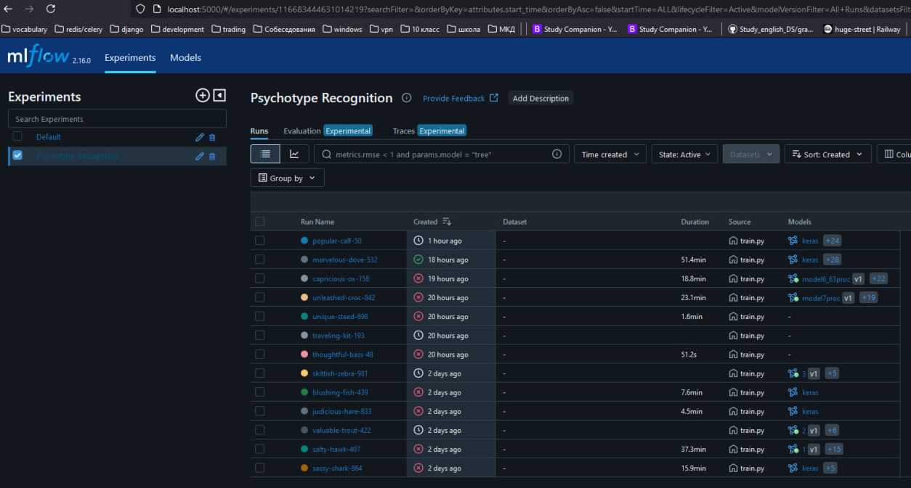
 - Так выглядят все запуски обучения моделей в вашем эксперименте Psychotype Recognition
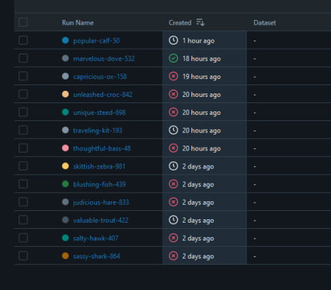  
 - Это обученные модели во время запусков, если модель подходит по качеству,
ее можно зарегистрировать и потом обращаться к ней по api mlflow <br>
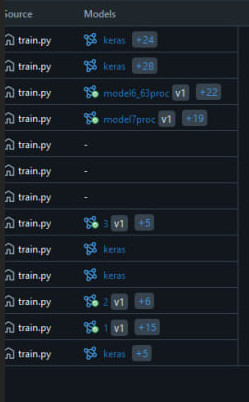
 - Здесь страница с параметрами и артефактами обучения
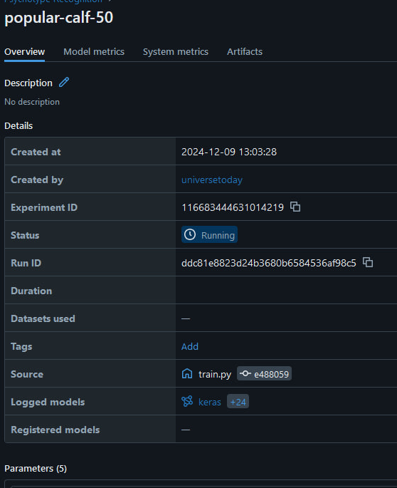
 - Пример артефактов обученных моделей, откуда можно забрать лучшую версию/зарегистрировать ее
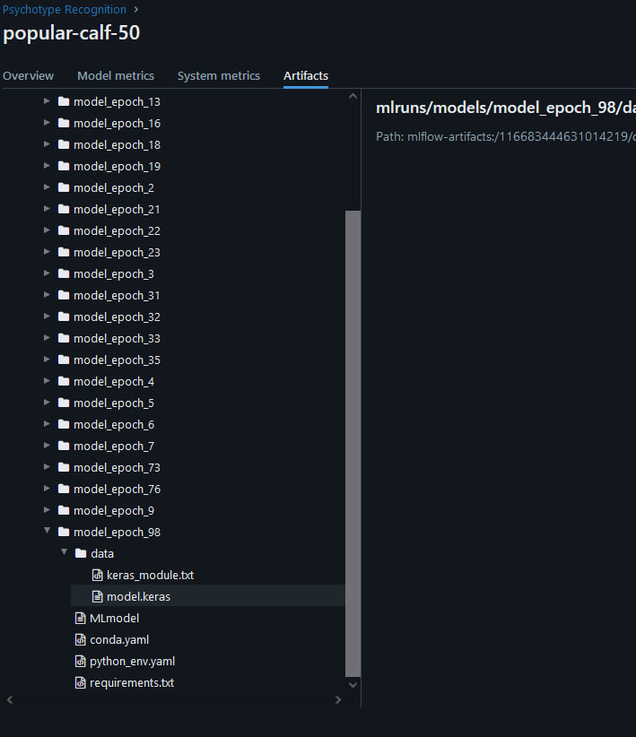
 - Пример графиков изменения ошибок и метрик во время обучения, все это на сервере mlflow
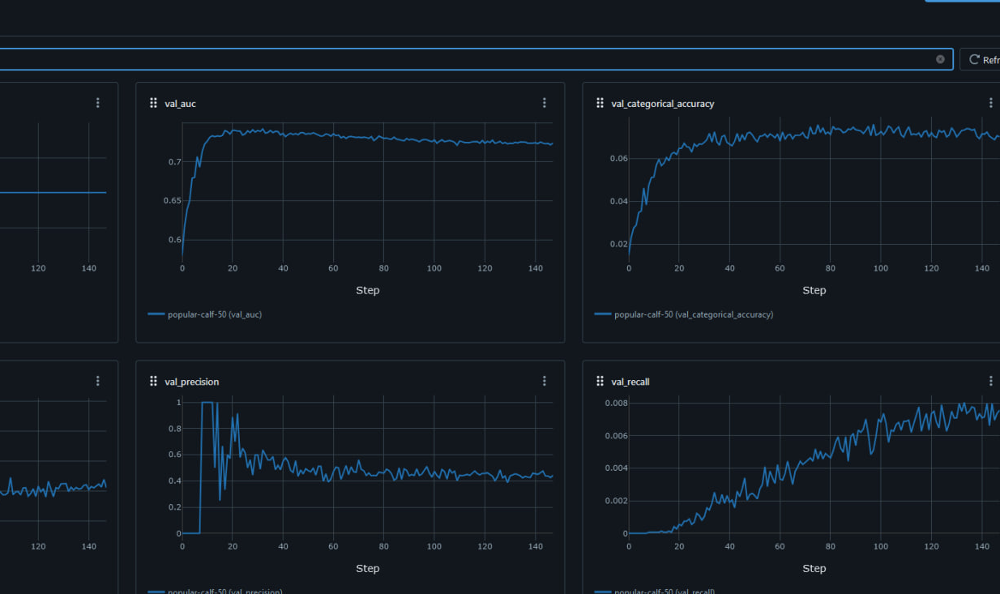

6. Обучите модель: загрузите файл train.py в IDE, поменяйте настройки, если необходимо, 
структуру модели можно поменять в файле module/create_model.py. Запустите файл train.py <br>
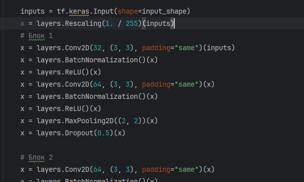

7. После того как вы обучили модели и выбрали лучшую, 
копируем файл модели model.keras из хранилища артефактов в папку проекта models/1/ <br>
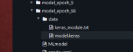<br>

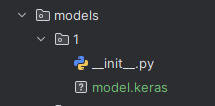
8. После этого можем запускать два сервиса (вебинтерфейс и инференс-сервер для модели)
 с помощью команды `docker-compose -p chara up --build`, где мы можем загрузить фото
и получить прогноз, к какому классу принадлежит данное изображение. <br>
- Так выглядят запущенные докер-контейнеры в Pycharm 
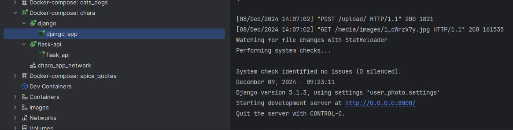
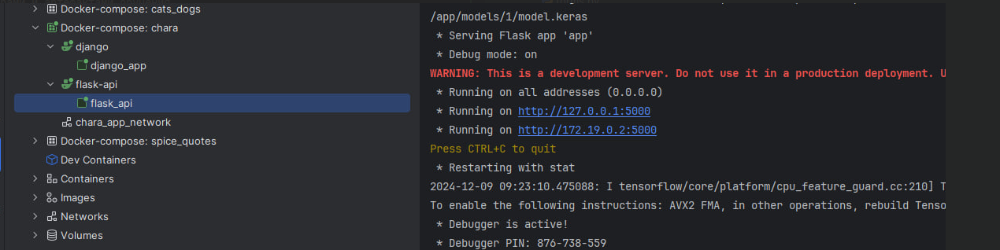

## Запуск Docker контейнеров для работы сервисов
`docker-compose -p chara up --build`

## Model API
`http://localhost:5001/predict`
 - Формат отправки и получения json
 - Данные на отправку в модель: `data = { "input": img_array.tolist()}`
 - Ответ инференс-сервера: `{"predictions": predictions}`


<a name="project_structure"></a> 
# Project structure
    Chara
    ├── module/
    │   ├── __init__.py
    │   ├── convert_image_name.py
    │   ├── create_model.py
    │   ├── edit_image_name.py
    │   └── load_train_test_val.py
    ├── images/
    │   └── __init__.py
    ├── tests/
    │   ├── __init__.py
    │   ├── test_convert_image_name.py
    │   ├── test_create_model.py
    │   ├── test_edit_image_name.py
    │   └── test_load_train_test_val.py
    ...
    │
    ├── make_data.py                    # Create dataset 
    ├── DockerFile                      # Launch Project in Docker
    ├── README.md                       # Project documentation
    └── requirements.txt                # File with dependencies
<br /> <br />
